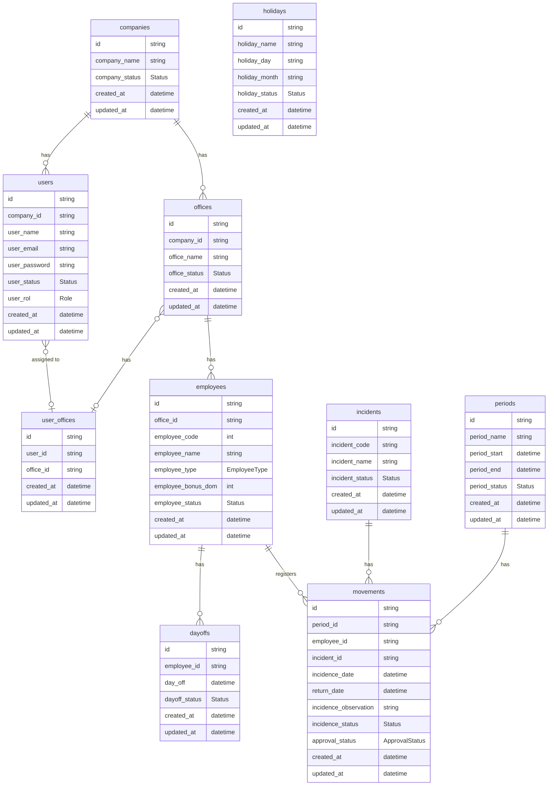

## 🗺️ Diagrama de Entidades y Relaciones (Base de Datos)

```mermaid
erDiagram
  companies ||--o{ offices : "has"
  companies ||--o{ users : "has"
  offices ||--o{ employees : "has"
  users }o--o| user_offices : "assigned to"
  offices }o--o| user_offices : "has"
  employees ||--o{ movements : "registers"
  employees ||--o{ dayoffs : "has"
  incidents ||--o{ movements : "has"
  periods ||--o{ movements : "has"

  companies {
    id string
    company_name string
    company_status Status
    created_at datetime
    updated_at datetime
  }
  offices {
    id string
    company_id string
    office_name string
    office_status Status
    created_at datetime
    updated_at datetime
  }
  employees {
    id string
    office_id string
    employee_code int
    employee_name string
    employee_type EmployeeType
    employee_bonus_dom int
    employee_status Status
    created_at datetime
    updated_at datetime
  }
  incidents {
    id string
    incident_code string
    incident_name string
    incident_status Status
    created_at datetime
    updated_at datetime
  }
  periods {
    id string
    period_name string
    period_start datetime
    period_end datetime
    period_status Status
    created_at datetime
    updated_at datetime
  }
  movements {
    id string
    period_id string
    employee_id string
    incident_id string
    incidence_date datetime
    return_date datetime
    incidence_observation string
    incidence_status Status
    approval_status ApprovalStatus
    created_at datetime
    updated_at datetime
  }
  users {
    id string
    company_id string
    user_name string
    user_email string
    user_password string
    user_status Status
    user_rol Role
    created_at datetime
    updated_at datetime
  }
  user_offices {
    id string
    user_id string
    office_id string
    created_at datetime
    updated_at datetime
  }
  holidays {
    id string
    holiday_name string
    holiday_day string
    holiday_month string
    holiday_status Status
    created_at datetime
    updated_at datetime
  }
  dayoffs {
    id string
    employee_id string
    day_off datetime
    dayoff_status Status
    created_at datetime
    updated_at datetime
  }
```
